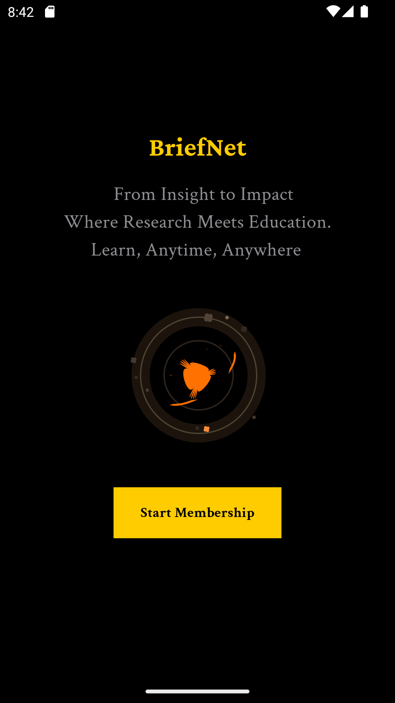
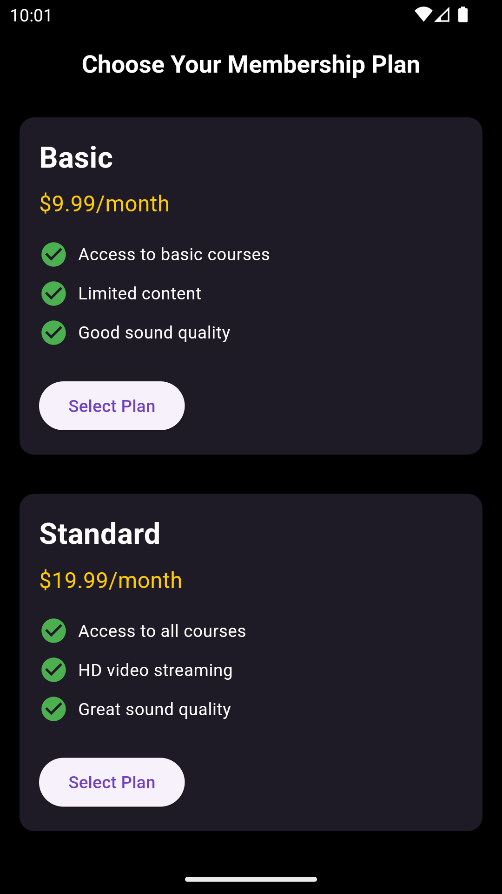
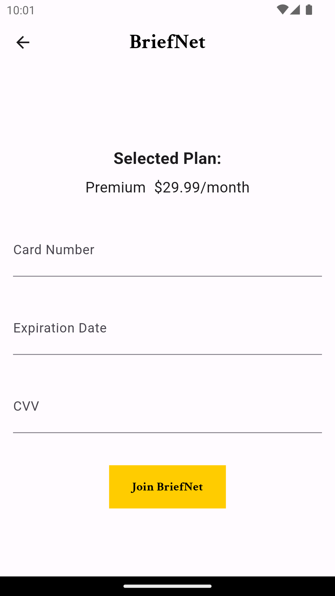

# BriefNet
Welcome to BriefNet, your premier educational platform designed to revolutionize the way you engage with specialized learning content. Whether you're a student, professional, or lifelong learner, BriefNet offers an unparalleled learning experience tailored to your needs and interests.

About BriefNet
BriefNet is a cutting-edge educational platform built on the foundation of extensive research into modern learning methodologies and user preferences. Our platform operates on a subscription-based model, providing unlimited access to a diverse array of educational series structured similarly to popular streaming services like Netflix Originals.

# Key Features
1. Unlimited Access
With BriefNet, you enjoy unlimited access to a vast library of educational series covering a wide range of topics, from science and technology to humanities and arts. Say goodbye to restrictions and explore the world of knowledge at your own pace.

2. Curated Content
Our team of experts meticulously curates each series to ensure the highest quality of educational content. Dive deep into captivating topics presented in engaging formats, carefully designed to spark curiosity and foster learning.

3. Personalized Learning
At BriefNet, we understand that every learner is unique. That's why our platform offers personalized recommendations based on your interests, preferences, and learning history. Tailor your learning journey to suit your individual needs and aspirations.

4. Seamless Experience
Experience seamless learning across devices with our intuitive and user-friendly interface. Whether you're on your desktop, tablet, or smartphone, BriefNet adapts to your screen size and provides a consistent experience anytime, anywhere.

# Screenshots

# Get Started
Ready to embark on your journey of discovery with BriefNet? Sign up today and unlock a world of knowledge at your fingertips!

Feedback and Support
Have questions or feedback? We're here to help! Reach out to our dedicated support team for assistance or visit our documentation for helpful resources.